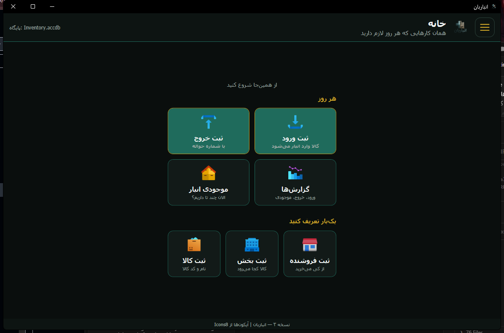

# انباربان — سیستم انبار (نسخه ۳)

<p align="center">
  
</p>

<p align="center">
  <strong>اپ ویندوزی فارسی · RTL · برای انبار روزمره — بدون Access روی PC انبار</strong>
</p>

<p align="center">
  <a href="https://github.com/mmovasseghi/Anbardari-Access-2010/releases/tag/v3.0.3">دانلود پرتابل v3.0.3</a>
  ·
  <a href="v3/README.md">راهنمای توسعه‌دهنده</a>
  ·
  <a href="release/RELEASE_NOTES_v3.0.3.md">یادداشت انتشار</a>
</p>

---

## دانلود و اجرا (۲ دقیقه)

| مرحله | کار |
|--------|-----|
| ۱ | از [Release v3.0.3](https://github.com/mmovasseghi/Anbardari-Access-2010/releases/tag/v3.0.3) فایل **`Anbarban-v3-Portable.zip`** را بگیرید |
| ۲ | Extract در هر پوشه (مثلاً `D:\Anbarban`) |
| ۳ | دوبارکلیک **`شروع انباربان.bat`** |

**پیش‌نیاز (یک بار):** Windows 7+ · [.NET Framework 4.8](https://dotnet.microsoft.com/download/dotnet-framework/net48) · **Microsoft ACE OLEDB 12.0 (64-bit)**

اگر `Data\Inventory.accdb` نبود، با اولین اجرا (با ACE) معمولاً خودکار ساخته می‌شود؛ یا **`ساخت-پایگاه-داده.bat`** را بزنید.

**بکاپ:** فقط `Data\Inventory.accdb` را کپی کنید.

---

## انباربان چیست؟

برای **انبار کوچک و متوسط** که می‌خواهد ورود، خروج، موجودی و گزارش را **با دکمه‌های واضح** انجام دهد — نه Excel پراکنده، نه ERP سنگین.

| مسیر روزانه | در اپ |
|-------------|--------|
| کالا وارد شد | **ثبت ورود** → قلم‌ها → **ثبت نهایی** |
| کالا خارج شد | **ثبت خروج / حواله** → بخش → **ثبت نهایی** |
| چند تا داریم؟ | **موجودی انبار** / گزارش کم‌موجودی |
| گزارش مدیر | **گزارش‌ها** → **گزارش‌گیری** (دکمه پایین صفحه) |

ثبت **دو مرحله‌ای** است: تا «ثبت نهایی» موجودی عوض نمی‌شود. سند نهایی با **کد ۶ حرفی مدیر** قابل بازگشت است (`tools/` داخل ZIP).

---

## تصاویر — نسخه ۳ (WPF)

### صفحهٔ خانه — کارهای هر روز و تعریف پایه

تم تیره، کارت‌های بزرگ، آیکون‌های Icons8، کاملاً **راست‌به‌چپ**.



| در تصویر | توضیح |
|---------|--------|
| **هر روز** | ورود، خروج، موجودی، گزارش — یک کلیک |
| **یک‌بار تعریف کنید** | فروشنده، بخش، کالا |
| هدر | نام پایگاه (`Inventory.accdb`) + منوی همبرگر |

### جستجوی زنده و تقویم شمسی

در فرم‌های ورود/خروج و گزارش: **SearchCombo** (تایپ + پیشنهاد کوتاه) و **JalaliDatePicker**.

### ثبت نهایی و پیام‌ها

بعد از تأیید: صفحهٔ موفقیت با تیک و دکمه‌های «ثبت جدید / خانه» — بدون MessageBox خاکستری ویندوز.

> اسکرین‌شات‌های بیشتر: پوشه [`docs/screenshots/v3/`](docs/screenshots/v3/)

---

## ویژگی‌های کلیدی (v3)

| قابلیت | جزئیات |
|--------|--------|
| ورود کالا | فاکتور، فروشنده، چند قلم، تأیید قبل از افزایش موجودی |
| خروج / حواله | شماره حواله، بخش هر قلم، کنترل «موجودی کافی نیست» |
| موجودی | فقط از مسیر سند — دستی روی عدد موجودی نیست |
| گزارش | ورود+خروج، موجودی، کم‌موجودی، فروشنده، بخش، حواله، گردش کالا |
| UI | فارسی محاوره‌ای، RTL، منو از راست، اسکرول و دکمه‌های اصلی ثابت |
| داده | `Inventory.accdb` — همان منطق ۸ جدول نسل قبل |

---

## ساخت از سورس (توسعه‌دهنده)

```bat
cd v3
dotnet build Anbarban.sln -c Release
dotnet test Anbarban.Tests\Anbarban.Tests.csproj -c Release
```

خروجی: `v3\Anbarban.Wpf\bin\Release\net48\Anbarban.exe`

پرتابل محلی:

```bat
v3\scripts\Make-Portable.bat
```

→ `release\Anbarban-v3-Portable.zip`

تست UI (اختیاری):

```bat
cd v3\Anbarban.Wpf\bin\Release\net48
set ANBARBAN_UI_TEST=1
Anbarban.exe --ui-test
```

---

## ساختار ریپو

```text
v3/                    ★ اپ WPF + تست‌ها (نسخه فعلی)
  Anbarban.Wpf/        رابط و منطق
  Anbarban.Tests/      xUnit — posting و گزارش
  scripts/             پرتابل، اسکرین‌شات README

release/               ZIPهای آماده و RELEASE_NOTES
database/              محل Inventory.accdb بعد از ساخت (Access)
build/                 ساخت دیتابیس نسل Access
docs/                  مستندات + screenshots/
portable/              نسخه ۱ — HTA/مرورگر (قدیمی)
```

---

## نسخه‌های قبلی (آرشیو)

| نسخه | مخاطب | دانلود |
|------|--------|--------|
| **v3** | **پیشنهاد — WPF پرتابل** | [v3.0.3](https://github.com/mmovasseghi/Anbardari-Access-2010/releases/tag/v3.0.3) |
| v2.0 | داخل Microsoft Access 2010 | [v2.0.0](https://github.com/mmovasseghi/Anbardari-Access-2010/releases/tag/v2.0.0) · [`release/Anbarban-v2.0-Access-2010.zip`](release/Anbarban-v2.0-Access-2010.zip) |
| v1.0 | پرتابل مرورگر (legacy) | [`release/Anbardari-v1.0-Windows.zip`](release/Anbardari-v1.0-Windows.zip) |

### تصاویر نسخهٔ اول (رابط Access / HTA — آرشیو)


گالری کامل UI قدیم: `docs/screenshots/01-home.png` … `08-inout-report.png`

---

## مستندات

| سند | موضوع |
|-----|--------|
| [`v3/README.md`](v3/README.md) | معماری v3، ACE، پرتابل |
| [`docs/TUTORIAL.md`](docs/TUTORIAL.md) | آموزش کاربر |
| [`docs/OPERATOR_UX.md`](docs/OPERATOR_UX.md) | اصول UX اپراتور |
| [`docs/MANAGER_UNLOCK.md`](docs/MANAGER_UNLOCK.md) | کد مدیر |
| [`docs/SCHEMA.md`](docs/SCHEMA.md) | جداول |

---

## مخاطب و اصل طراحی

مسئول انبار و اپراتوری که **حرفه‌ای کامپیوتر نیست** — ساده، واضح، کم‌کلیک، جلوگیری از اشتباه (موجودی منفی، خروج بدون حواله، ثبت دوباره).

---

## مجوز و استفاده

برای استفاده در انبار واقعی و توسعهٔ کنترل‌شده. قبل از تولید، یک بار با دادهٔ نمونه یا کپی DB تست کنید.

---

<p align="center"><sub>نسخهٔ README برای <strong>انباربان v3</strong> — آخرین پرتابل: <strong>v3.0.3</strong></sub></p>
