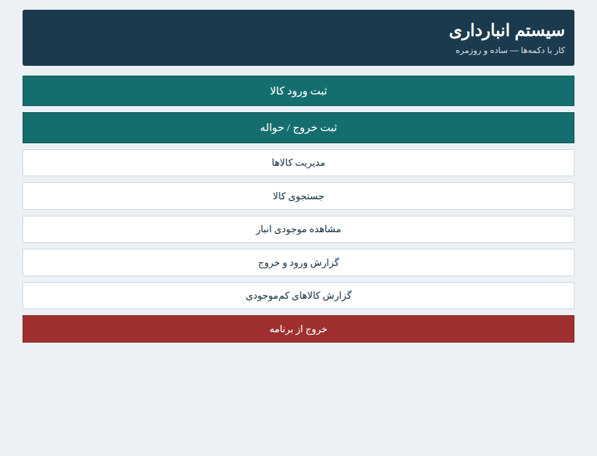
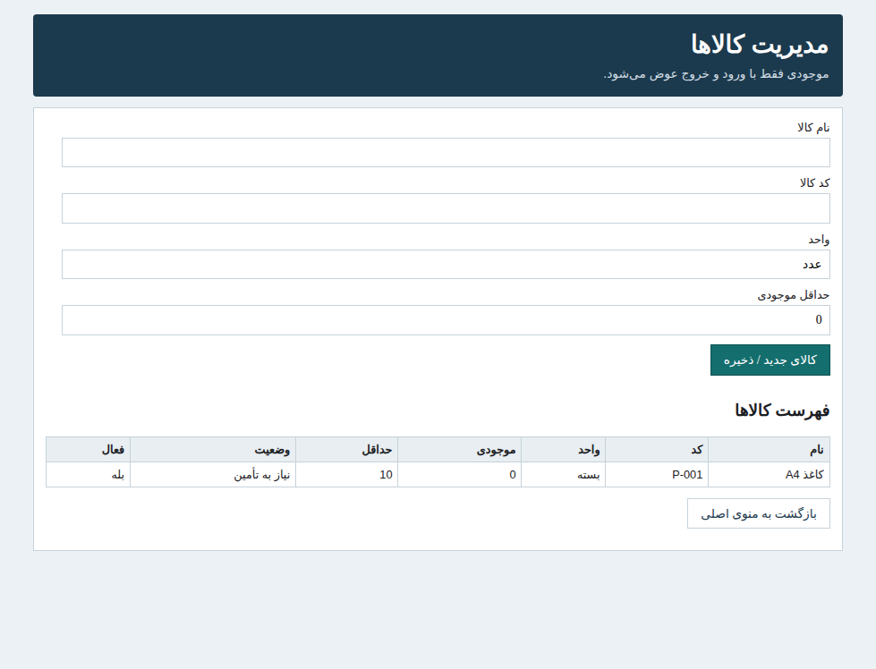
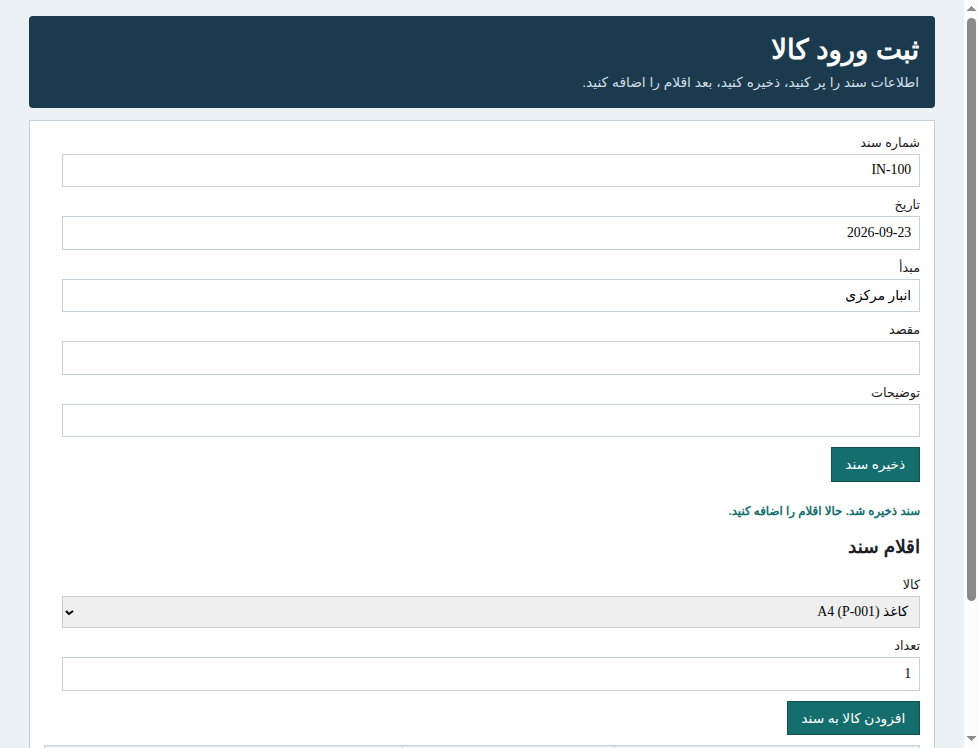
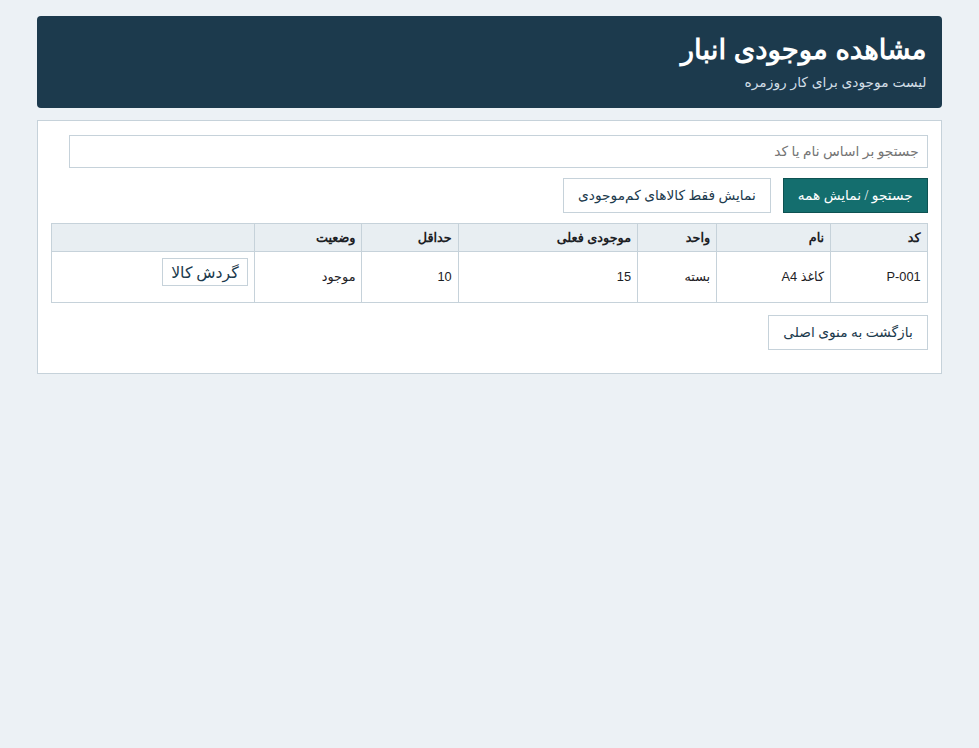
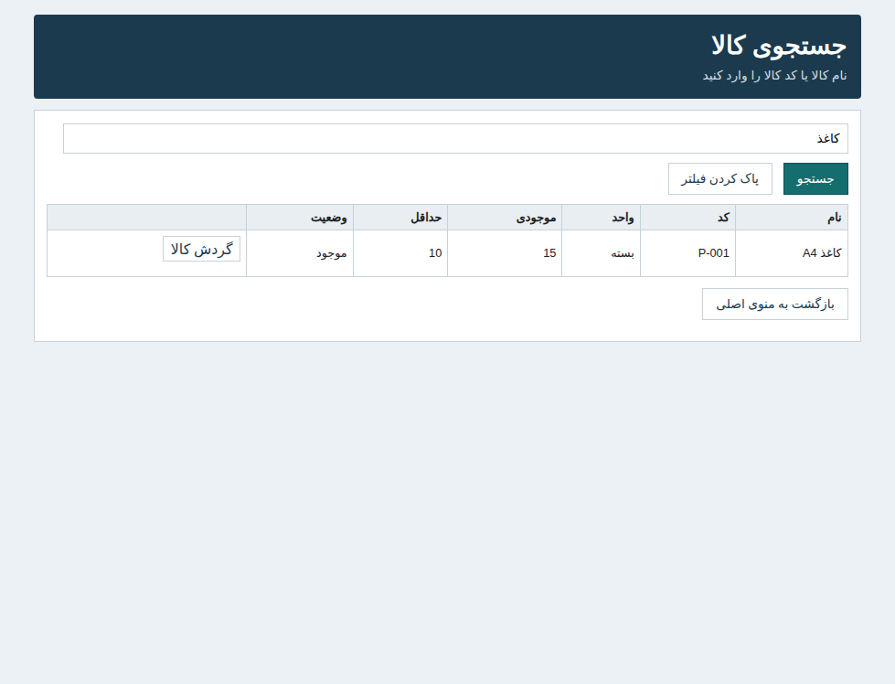
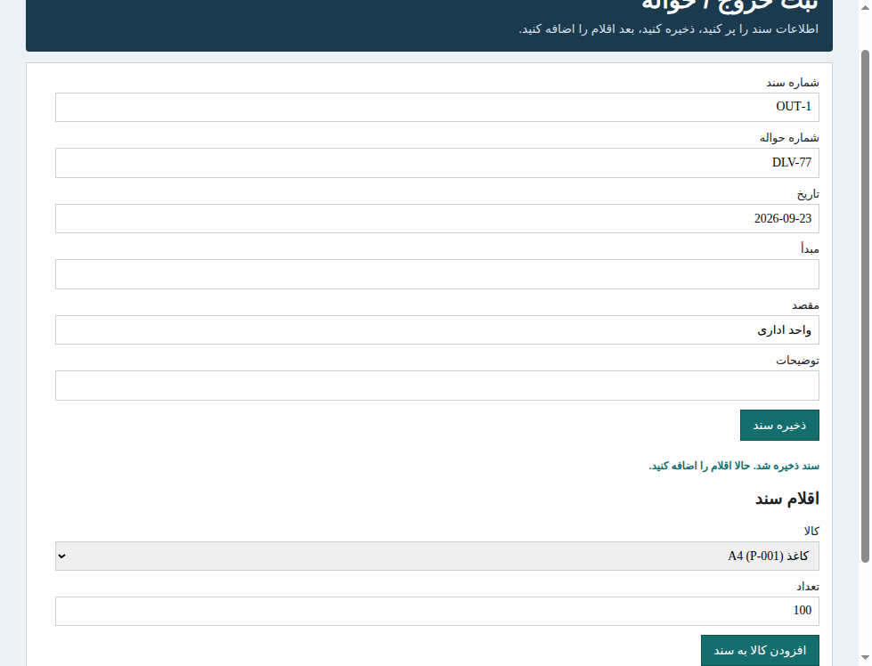
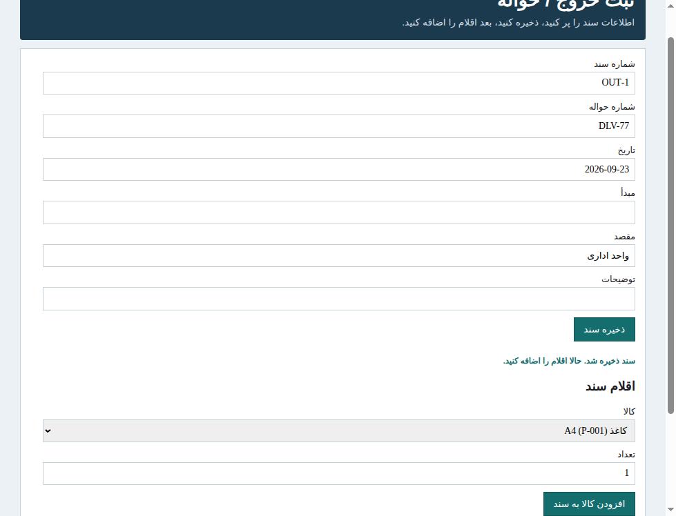
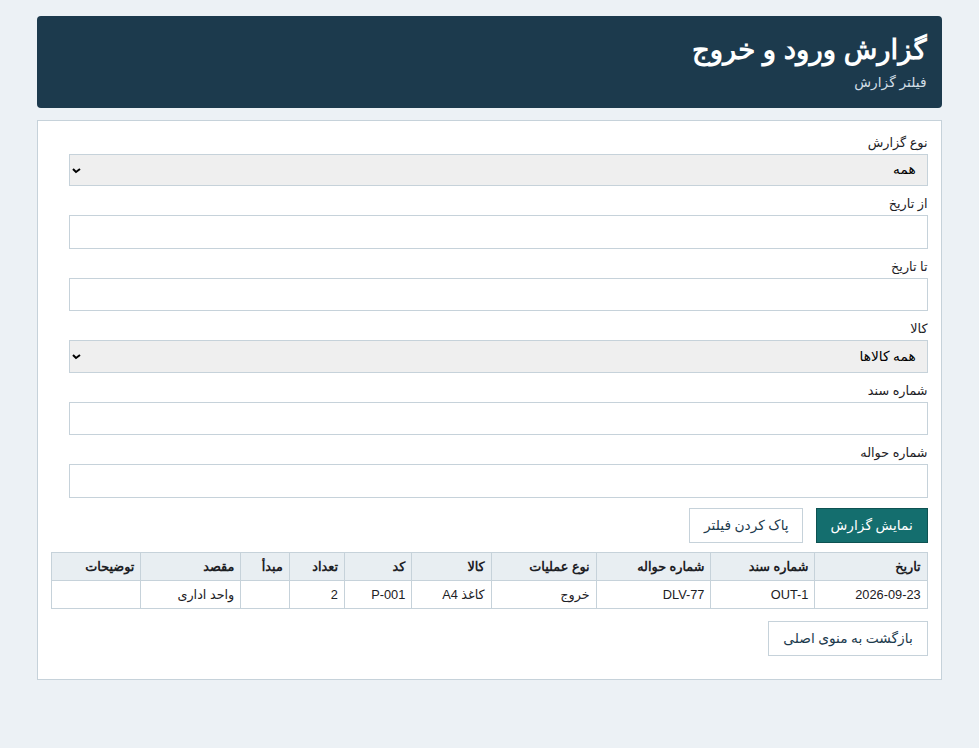

# انباربان — سیستم انبار (Access 2010)

> **نسخه جدید:** شمای ۷ جدول، ورود/خروج جدا، ثبت **دو مرحله‌ای**، تاریخ **شمسی**، فروشنده و بخش، قفل سند با **کد مدیر**. جزئیات: `docs/GAP_ANALYSIS.md`

# سیستم ساده انبارداری



نرم‌افزار سبک و فارسی برای مدیریت روزمرهٔ انبار.  
طراحی‌شده برای اپراتوری که ممکن است با کامپیوتر حرفه‌ای نباشد — همه کارها با **دکمه‌های واضح** انجام می‌شود.

---

## این پروژه چه مشکلی را حل می‌کند؟

در خیلی از انبارهای کوچک و متوسط، ثبت ورود و خروج هنوز با دفتر، اکسل پراکنده یا نرم‌افزارهای سنگین انجام می‌شود.

این سیستم یک مسیر ساده می‌دهد:

1. کالا را پیدا کن  
2. ورود را ثبت کن  
3. خروج / حواله را ثبت کن  
4. موجودی را ببین  
5. گزارش بگیر  

بدون درگیر شدن با جدول، ID، Query یا اصطلاحات فنی.

---

## ویژگی‌های اصلی

| قابلیت | توضیح |
|---|---|
| ثبت ورود کالا | پیش‌نویس → تأیید با فاکتور → **سپس** افزایش موجودی |
| ثبت خروج / حواله | هر قلم **بخش** جدا؛ کنترل موجودی در ثبت نهایی |
| فروشندگان و بخش‌ها | فهرست ثابت — بدون اشتباه تایپی |
| مدیریت کالاها | موجودی فقط خواندنی |
| جستجو و گزارش‌ها | ورود، خروج، فروشنده، بخش، حواله، گردش کالا |
| مشاهده موجودی / کم‌موجودی | گزارش و فرم ساده |
| سند نهایی | قفل + باز کردن با کد ۶ رقمی (`tools/generate_unlock_code.py`) |

### جلوگیری از اشتباه کاربر

- تعداد صفر یا منفی قبول نمی‌شود  
- خروج بیش از موجودی مسدود می‌شود و پیام فارسی واضح نشان داده می‌شود  
- خروج بدون شماره حواله مجاز نیست  
- کالا بدون نام ثبت نمی‌شود  
- موجودی به‌صورت دستی قابل تغییر نیست؛ فقط از مسیر ورود/خروج

---

## دانلود نسخه آماده (ساده‌ترین راه)

برای استفاده فوری، این فایل را بگیرید:

**[`release/Anbardari-v1.0-Windows.zip`](release/Anbardari-v1.0-Windows.zip)**

### فقط ۳ قدم

1. ZIP را دانلود و Extract کنید  
2. وارد پوشه شوید  
3. روی **`شروع.bat`** دوبار کلیک کنید  

نیازی به نصب هیچ برنامه‌ای نیست.

جزئیات نسخه: [`release/RELEASE_NOTES_v1.0.md`](release/RELEASE_NOTES_v1.0.md)

---

## شروع سریع از خود Repository

بدون نصب Access یا Python:

1. پوشه `portable` را روی ویندوز کپی کنید  
2. روی `شروع.bat` دوبار کلیک کنید  

برنامه باز می‌شود و آماده کار است.

> داده در `portable/data/inventory.json` ذخیره می‌شود.

آموزش کوتاه: [`docs/TUTORIAL.md`](docs/TUTORIAL.md)

---

## تصاویر محیط برنامه

### منوی اصلی
دکمه‌های بزرگ و فارسی برای همه کارهای روزمره.


### مدیریت کالاها
تعریف کالا بدون دستکاری موجودی.



### ثبت ورود کالا
اول ذخیره سند، بعد افزودن چند قلم کالا.



### مشاهده موجودی انبار
وضعیت به زبان ساده: **موجود** یا **نیاز به تأمین**.



### جستجوی کالا
با چند حرف از نام یا کد.



### کنترل موجودی هنگام خروج
اگر موجودی کافی نباشد، ثبت انجام نمی‌شود.



### ثبت خروج موفق
پس از تأیید موجودی، خروج ثبت و موجودی کم می‌شود.



### گزارش ورود و خروج
فیلتر ساده + نتیجه خوانا با برچسب «ورود / خروج».



---

## ساختار Repository

```text
portable/                 نسخه پرتابل آماده اجرا (ویندوز)
  شروع.bat / Start.bat
  app/                    رابط و منطق برنامه
  data/                   فایل داده

build/                    ساخت خودکار نسخه Access 2010
  ساخت-دیتابیس.bat
  Build-Inventory.vbs

database/                 خروجی Inventory.accdb (بعد از ساخت)
docs/                     راهنما، UX، شما، آموزش، اسکرین‌شات
vba/                      ماژول‌ها و کد فرم‌های Access
forms/                    مشخصات فرم‌های Access
queries/                  کوئری‌های Access
sql/                      ساختار جداول و روابط
tests/                    تست منطق موجودی
```

---

## نسخه Microsoft Access 2010 (اختیاری)

اگر روی سیستم **Microsoft Access 2010** دارید:

1. وارد پوشه `build` شوید  
2. روی `ساخت-دیتابیس.bat` دوبار کلیک کنید  
3. فایل `database/Inventory.accdb` ساخته می‌شود  

جزئیات:

- [`docs/AUTO_BUILD.md`](docs/AUTO_BUILD.md)  
- [`docs/BUILD_GUIDE.md`](docs/BUILD_GUIDE.md)  
- [`docs/SCHEMA.md`](docs/SCHEMA.md)

### شمای داده

- `Products` — کالاها  
- `Documents` — اسناد ورود/خروج  
- `DocumentItems` — اقلام هر سند  

روابط با Referential Integrity فعال است.

---

## منطق کسب‌وکار

| عملیات | مقدار داخلی | اثر روی موجودی |
|---|---|---|
| ورود | `IN` | افزایش `CurrentStock` |
| خروج | `OUT` | کاهش `CurrentStock` |

کاربر در رابط فقط «ورود» و «خروج» را می‌بیند.  
مقادیر فنی `IN/OUT` برای ذخیره داخلی هستند و در UI نمایش داده نمی‌شوند.

---

## مخاطب طراحی

این پروژه یک ERP یا نرم‌افزار حسابداری پیچیده نیست.

مخاطب:

- مسئول انبار  
- اپراتور انبار  
- کسب‌وکار کوچک/متوسط  

اصل طراحی:

**سادگی · وضوح · کم بودن مراحل · جلوگیری از اشتباه**

جزئیات تجربه کاربری: [`docs/OPERATOR_UX.md`](docs/OPERATOR_UX.md)

---

## سازگاری و اجرا

| محیط | وضعیت |
|---|---|
| ویندوز + نسخه پرتابل (`شروع.bat`) | پیشنهادی — بدون نصب اضافه |
| ویندوز + Microsoft Access 2010 | پشتیبانی کامل برای مسیر `.accdb` |
| سیستم ضعیف (رم حدود ۴ گیگ) | طراحی سبک و کم‌هزینه |

---

## تست

منطق موجودی با تست خودکار پوشش داده شده است:

```bash
python3 tests/test_stock_logic.py
```

سناریوها شامل ورود، خروج، جلوگیری از موجودی منفی، حواله اجباری، چند قلم در سند و اصلاح موجودی پس از حذف/ویرایش است.

---

## مستندات

| فایل | موضوع |
|---|---|
| [`docs/TUTORIAL.md`](docs/TUTORIAL.md) | آموزش سریع کاربر |
| [`docs/OPERATOR_UX.md`](docs/OPERATOR_UX.md) | اصول رابط اپراتور |
| [`docs/AUTO_BUILD.md`](docs/AUTO_BUILD.md) | ساخت خودکار Access |
| [`docs/BUILD_GUIDE.md`](docs/BUILD_GUIDE.md) | ساخت دستی Access 2010 |
| [`docs/SCHEMA.md`](docs/SCHEMA.md) | ساختار جداول |
| [`docs/TEST_REPORT.md`](docs/TEST_REPORT.md) | نتیجه تست منطق |

---

## مجوز استفاده

این Repository برای استفاده عملی در انبار و توسعه کنترل‌شده آماده شده است.  
قبل از استفاده در محیط واقعی، یک بار با داده نمونه تست کنید.

---

## جمع‌بندی

اگر فقط می‌خواهید همین امروز کار را شروع کنید:

```text
portable → شروع.bat
```

اگر نسخه Access 2010 می‌خواهید:

```text
build → ساخت-دیتابیس.bat → database/Inventory.accdb
```
